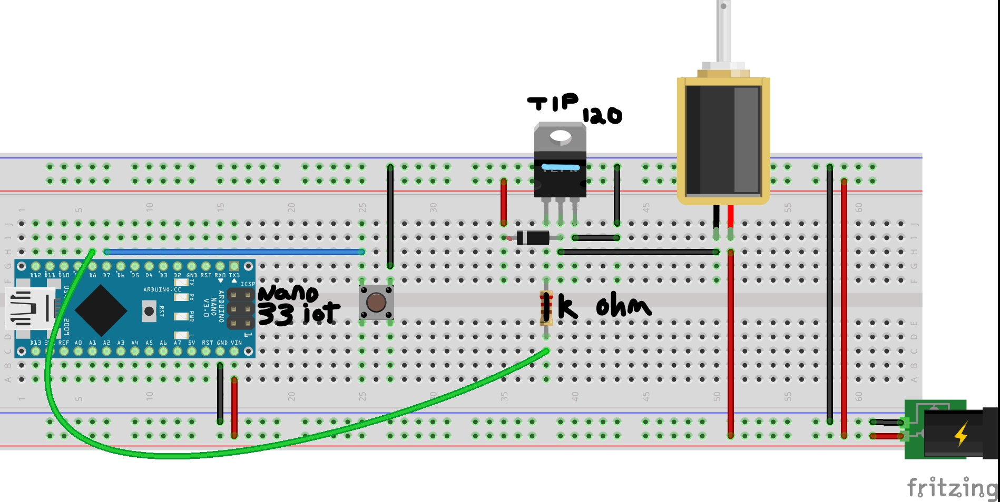
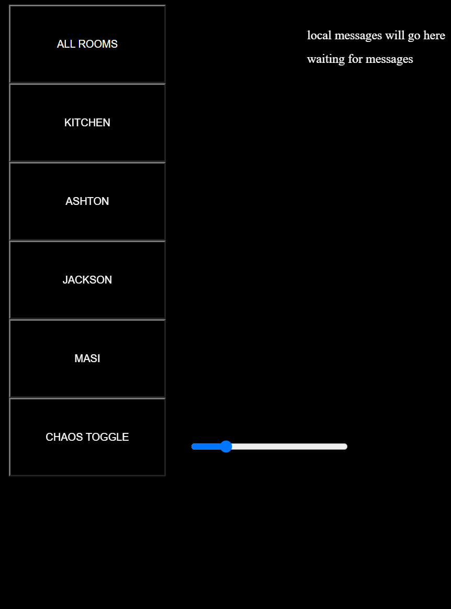
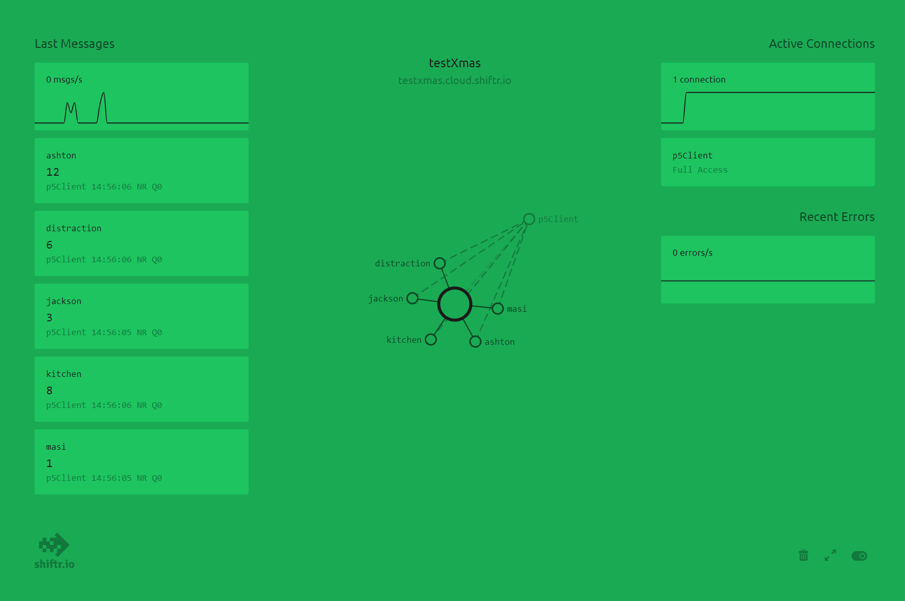

# MQTT_Playground
Collection of various projects using MQTT.

Based on Tom Igoe's great [MQTT Examples Repository](https://github.com/tigoe/mqtt-examples).

## Cacophony Society
A network of Arduino Nano 33 IoTs getting messages from a node server. Designed for first use as a distraction in an intense game of hide and seek where our team could use our phones to send decoy noises across the house from us. Once they caught on, we turned on the "chaos toggle" which sent messages at random but rapid intervals to all connected noise-makers for some psychological warfare. I used glitch to host the mobile interface and shiftr.io as the broker, as recommended by Tom in the above repo.

Once the free shiftr broker was set up and the mobile interface hosted on glitch, all we needed to do was plug in the nodes while the other team was counting, tape the solenoids to our noise-makers, and confirm the nanos were connected to the wifi by waiting for the on-board LED to light up and connected to the broker by pressing the push-button. Then we ran around with our phones out and cackled silently as they succumbed to our superior tactics!

You can find video examples at [my private instagram account](https://www.instagram.com/p/CJ9Y9tsp0hSOL6xNXwf-3zXh_5MLpf__KdTVa80) and perhaps later on [my website](https://augustluhrs.art) whenever I get around to updating that...

Solenoid refresher thanks to [jts3k's Instructable!](https://www.instructables.com/Controlling-solenoids-with-arduino/).

Each arduino .ino file in the arduino folder needs a corresponding "secrets.h" file as outlined in the comments of the .ino.
The public/sketch.js shiftr variables need to be updated for your individual broker, or you can use the public test broker. I'd normally hide my variable login info but I deleted that broker so figured I'd keep it so others can see where to put their own broker variables.
The Tom Test folder is just the template I was using from the above repo, though you need to comment out the while(!Serial) line in the .ino file so that this can run without being connected to your computer. I kept the random number message from the example since it really didn't matter what was being sent in the message.

**Wiring Diagram for the Cacophony Society Nodes**
- The solenoid is attached to an object that makes a lot of noise when the solenoid is activated (i.e. a kitchen pan, a metal desk leg, etc.)
- The push button is just for testing the connection -- it sends a message to the broker
- The on-board LED lights up and the solenoid activates when the nano recieves an on-topic message from the broker.
- Parts list:
    - Nano 33 iot
    - push button
    - 12v Solenoid
    - 12v DC Power
    - TIP 120 transistor
    - 1N4004 Diode
    - 1k ohm resistor
    - wires/breadboard
    - usb cable (only needed for upload)

**Mobile Interface for Triggering Nodes**
- Chose a black background in p5 so that the screen brightness wouldn't give away the hiders (the game was played in the dark)
- Used simple, big buttons for each, and highlighted the chaos toggle to know when it was on/off.
- The all rooms button would send one message to each node, the next four sent messages to individual nodes, and the chaos toggle sent a cacophony of messages across the whole system (rate adjusted by the slider)

**Shiftr Broker Visualization of Messages Sent Across Network**
- the "distraction" topic is for "all room" messages
- each other topic is individual per room

